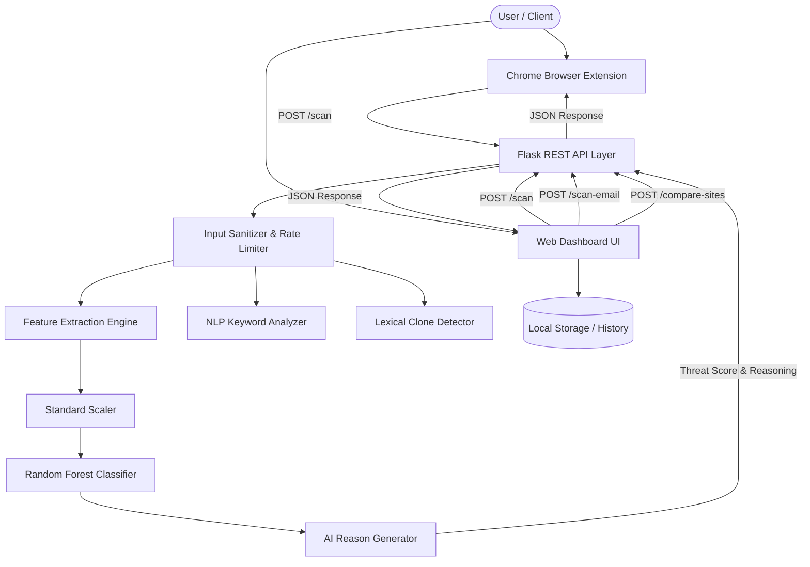
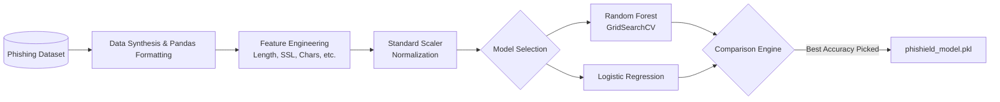
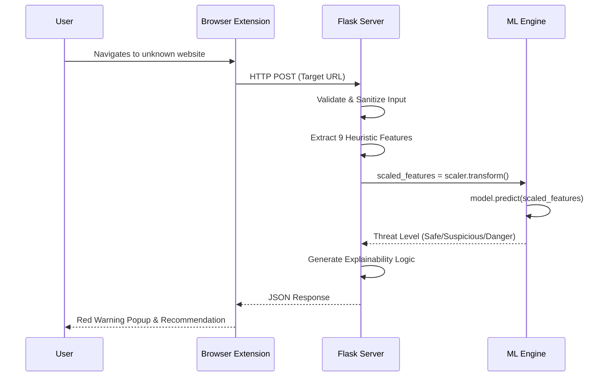

# Phishield AI - Architecture Diagrams

This document contains professional architecture diagrams generated via Mermaid.js. You can screenshot these or embed them directly into your PPT.

## 1. System Architecture Diagram

---

## 2. Machine Learning Pipeline Flow

---

## 3. Real-Time Detection Workflow

