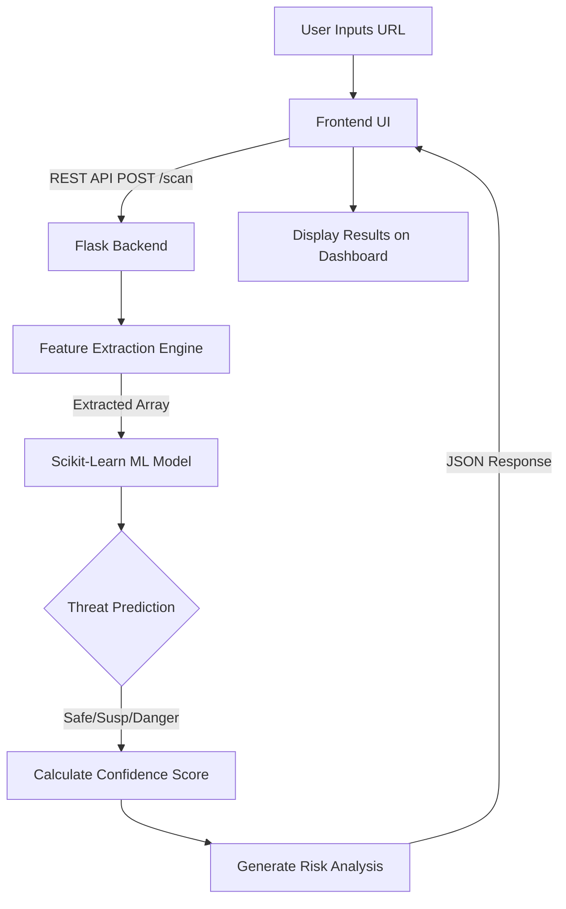

# Phishield AI – AI-Powered Phishing Detection System
**Hackathon Presentation Pitch Deck**

---

## 🛑 Slide 1: Title Slide
**Title:** Phishield AI
**Subtitle:** Next-Generation AI-Powered Phishing & Threat Detection
**Presenter:** Kriti
**Theme:** Dark background with neon blue/cyan accents

---

## ❗ Slide 2: Problem Statement
**The Cyber Epidemic**
- **Rise in Phishing Attacks:** Over 3.4 billion malicious emails are sent daily.
- **Deceptive URLs:** Cybercriminals use sophisticated URLs (typosquatting, hidden IPs) to bypass traditional security.
- **Human Vulnerability:** 90% of data breaches involve a human element, often starting with a deceptive link.
- **The Gap:** Traditional blacklist-based detection is too slow to catch zero-day phishing campaigns.

---

## 💡 Slide 3: The Solution
**Introducing Phishield AI**
- A proactive, Machine Learning-based URL scanner.
- Extracts unique behavioral features from URLs in real-time.
- Classifies URLs as **Safe**, **Suspicious**, or **Malicious** without relying solely on static blacklists.
- Provides users with an interpretable Confidence Score and precise Risk Analysis.

---

## ✨ Slide 4: Key Features
- **Real-Time Analysis:** Sub-second URL scanning.
- **Machine Learning Engine:** Powered by Random Forest Classification for high accuracy.
- **Risk Breakdown:** Explains exactly *why* a URL is dangerous (e.g., missing HTTPS, suspicious keywords, IP abuse).
- **Intuitive UI:** Modern, cyberpunk-inspired dashboard designed for user awareness.
- **Scalable Architecture:** Lightweight Flask backend ready for API integration.

---

## ⚙️ Slide 5: Technology Stack
- **Frontend:** HTML5, CSS3, Vanilla JS (Glassmorphism & Responsive Design)
- **Backend:** Python Flask
- **Machine Learning:** Scikit-Learn, Pandas, NumPy
- **Model Used:** Random Forest Classifier (n_estimators=100)
- **Deployment Ready:** Gunicorn / Docker compatible

---

## 🏗️ Slide 6: System Architecture & Workflow

---

## 🧠 Slide 7: Machine Learning Approach
**Feature Extraction Parameters:**
1. **Structural:** URL length, Number of dots, Number of slashes.
2. **Protocol Verification:** Presence of HTTPS.
3. **Anomalies:** Usage of IP Address instead of a domain name.
4. **Lexical Analysis:** Presence of suspicious keywords (`login`, `update`, `verify`, `bank`, `crypto`).
5. **Obfuscation:** High count of special characters (`@`, `-`, `?`).

**Performance:**
- High accuracy maintained using ensemble learning (Random Forest).
- Robust against overfitting compared to standard decision trees.

---

## 📸 Slide 8: Screenshots / Live Demo
*(Placeholder for actual application screenshots during presentation)*
- **Screen 1:** Landing page with glowing radar animation.
- **Screen 2:** Scanning interface analyzing a payload.
- **Screen 3:** Result dashboard showing "Malicious" warning, 98% confidence, and risk breakdown.

---

## 🚀 Slide 9: Future Scope & Advanced Features
- **Browser Extension Integration:** Auto-scan links on pages in real-time (Chrome/Firefox).
- **Computer Vision Verification:** Screenshot comparison of a fake site vs. a genuine brand site.
- **Email Integration:** Connect via IMAP to flag phishing emails automatically.
- **Live Reputation API:** Integration with VirusTotal or Google Safe Browsing APIs as a secondary layer.

---

## 🌍 Slide 10: Social Impact
- Protects non-tech-savvy users from financial fraud and identity theft.
- Reduces corporate vulnerability to ransomware attacks originating from spear-phishing.
- Democratizes cybersecurity through an easy-to-use, transparent tool.

---

## 👥 Slide 11: The Team
- **Kriti**
- Lead Developer & AI Researcher
- *(Add other team members here)*

---

## 🎯 Slide 12: Conclusion & Q&A
**"Empowering users to browse the web fearlessly."**

**Thank You!**
- GitHub: `github.com/kriti/phishield-ai` *(example)*
- Questions?
